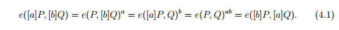
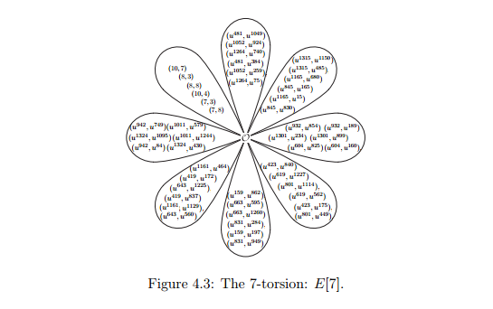

# a guide for Pairing

## basic concept

### `general Weierstrass equation`


### `short Weierstrass equation`


### `Group Law`


### `affine space`

- equation: `E: y^2 = x^3 + a*x + b`

    (x, y)

- add and double

    

### `projective space`

- equation: `Ep: Y^2*Z = X^3 + a*X*Z^2 + b*Z^3`

    (X, Y, Z)

- conversion:

    (x, y) -> (X, Y, Z)

        (x, y) -> (x, y, 1)
        (x, y) -> (kx, ky, k)

    (X, Y, Z) -> (x, y)

        (X, Y, Z) -> (X/Z, Y/Z)

- add: P + Q = R

    

- Jacobian coordinates

    x = X/Z^2

    y = Y/Z^3

    Y^2 = X^3 + 4*X*Z^4 − Z^6

### `Jacob-quartic curve`

- equation:

    J : v^2 = a*u^4 + d*u^2 + 1

- conversion:

    E -> J:

    (x, y) -> (U, V, W)

    

    J -> E:
        
    (U, V, W) -> (x, y)

    

- add: P1 + P2 = P3

    

### other curves

`Edwards curves`

`Hessian curves`

`Montgoemry curves`

### Elliptic Curve computation

E(Fp): y^2 = x^3 + ax +b

`M` Multiplication

`S` Squaring

`I` Inversion

| COST              | R = [2]Q      | R = P + Q     | 
| ---               | ---           | ---           |
| Affine            | 2M + 2S + I   | 2M + S + I    |
| Projective        | 5M + 6S       | 12M + 2S      |
| Jacobi-Quartics   | 2M + 5S       | 6M + 4S       |

most optimised implementations of Fq arithmetic have I ≫ 20M, and the multiplication to
inversion ratio is commonly reported to be 80 : 1 or higher.

### Some characteristics

`Example 2.2.1`. Consider E/F101 : y^2 = x^3 + x + 1. The group
order is `#E(Fq)` = 105 = 3·5·7, and P = (47, 12) ∈ E is a `generator`. `Lagrange’s theorem` says that points (and subgroups) over the base field will have order
in {1, 3, 5, 7, 15, 21, 35, 105}. Indeed, to get a point of order r | 105, we simply
multiply P by the appropriate cofactor, which is h = #E/r. For example, a point
of order 3 is [35](47, 12) = (28, 8), a point of order 21 is [5](47, 12) = (55, 65),
and a point of order 1 is [105](47, 12) = O (which is the only such point). 
By definition, a point is “killed” (sent to O) when multiplied by its order. Any point
over the full closure E(Fq) that is killed by r is said to be in the `r-torsion`. So,
the point (55, 65) above is in the 21-torsion, as is the point (28, 8). There are
exactly 21 points in E(Fq) in the 21-torsion, but there are many more in E(Fq).

### Divisor

A divisor D on E is a convenient way to denote a multi-set of points on E, 
written as the formal sum:


`zero divisor 0` - all `np` == 0

`degree` of divisor - Deg(D) = sum(`np`)

`support` of divisor - unique element set {P0, P1, P3...}

Example:
```php
# suppose
P, Q, R, S ∈ E(_Fq)
D1 = 2(P ) − 3(Q)
D2 = 3(Q) + (R) − (S)
# then
Deg(D1) = 2 − 3 = −1
Deg(D2) = 3 + 1 − 1 = 3
D1 + D2 = 2(P )+(R)−(S)
Deg(D1 + D2) = Deg(D1) + Deg(D2) = 2
supp(D1) = {P, Q}
supp(D2) = {Q, R, S}
supp(D1 + D2) = {P, R, S}
```

#### divisor of a function f


## Pairing

### concept

a `pairing` is a bilinear map on an abelian group M 
taking values in some other abelian group R:


`linear`:


notation commonly used for the bilinear map


Currently, the only known instantiations of pairings suitable for cryptography
are the `Weil` and `Tate` pairings on `divisor class groups` of algebraic curves, and in
the simplest and most efficient cases, on elliptic curves. 

The groups G1 and G2 are defined in `E(Fq^k)`, and
the target group GT is defined in the multiplicative group *Fqk, so we usually write
G1 and G2 `additively`, whilst we write GT `multiplicatively`

for scalars a, b ∈ Z



Tips

- The main such statement is that computing the pairing e(P, Q), in either the Weil
or Tate sense, requires that P and Q come from disjoint cyclic subgroups of the
`same prime order r`. 

How to find 2 groups with the same order `r`:

- Namely, we extended Fq to Fq^2 and saw that E(Fq^2)\E(Fq) had at least one other
subgroup of order r, where we were able to define Q and subsequently compute
e(P, Q)


Also at the heart of
our discussion then, is the entire group of points of order r on E(_Fq), called the
`r-torsion`, which is denoted by `E[r]` and defined as `E[r] = {P ∈ E : [r]P = O}`

`E[r] ∼= Zr × Zr.` (4.2)

`#E[r] = r^2` -  `r^2 = (r+1)*(r-1) + 1`

`(r+1)` extension group E(Fp^k)   ?????????

`(r-1)` r-torsion point in each extension group   ????????? 

`+1`    the infinity point, unique

Equation (4.2) implies that (for prime r)
the r-torsion consists of r+1 cyclic subgroups of order r.





#### Pairing types

in fact, it will soon become obvious that it is
always best to set G1 = _G1_, so the four types really are tied to the definition of
G2. 

The main factors affecting the classification are the ability to hash and/or
randomly sample elements of G2, the existence of an isomorphism ψ : __G2__ → __G1__
which is often required to make security proofs work (see [GPS08]), and (as
always) issues concerning storage and efficiency.

base-field group _G1_ = E[r] ∩ Ker(π − [1]) with generator _P1_

the trace-zero subgroup _G2_ = E[r] ∩ Ker(π − [q]) with generator _P2_

Let P1 be the generator of __G1__ and P2 be the generator of __G2__. 


- Type 1 pairings. 

    E is supersingular

    __G1__ = __G2__ = _G1_ (with P1 = P2 = _P1_)

    e(P, Q) = ˆe(P, φ(Q)), where ˆe is the Weil or Tate pairing. 

- Type 2 pairings.

    E is ordinary

    __G1__ = _G1_

    P1 = _P1_

    __G2__ is any of the r-1 subgroups in E[r] that is not _G1_ or _G2_ 

- Type 3 pairings. (`default`)

    E is ordinary

    __G1__ = _G1_

    P1 = _P1_

    __G2__ = _G2_

- Type 4 pairings.

    E is ordinary

    __G1__ = _G1_

    P1 = _P1_

    __G2__ to be the whole r-torsion E[r], which is a group of order r^2

#### twists of elliptic curves

first applied to pairinigs by Barreto et al.[BLS03]

### Paramaters

```js
var ROM_CURVE_FP256BN = {

    // FP256BN Curve
    // Base Bits= 24

    CURVE_A: 0,
    CURVE_B_I: 3,
    CURVE_B: [0x3, 0x0, 0x0, 0x0, 0x0, 0x0, 0x0, 0x0, 0x0, 0x0, 0x0],
    CURVE_Order: [0xB500D, 0x536CD1, 0x1AF62D, 0x129992, 0xDC65FB, 0xA49E0C, 0x5EEE71, 0x46E5F2, 0xFCF0CD, 0xFFFFFF, 0xFFFF],
    CURVE_Gx: [0x1, 0x0, 0x0, 0x0, 0x0, 0x0, 0x0, 0x0, 0x0, 0x0, 0x0],
    CURVE_Gy: [0x2, 0x0, 0x0, 0x0, 0x0, 0x0, 0x0, 0x0, 0x0, 0x0, 0x0],

    CURVE_Bnx: [0xB0A801, 0xF5C030, 0x6882, 0x0, 0x0, 0x0, 0x0, 0x0, 0x0, 0x0, 0x0],
    CURVE_Cof: [0x1, 0x0, 0x0, 0x0, 0x0, 0x0, 0x0, 0x0, 0x0, 0x0, 0x0],
    CURVE_Cru: [0xA1B807, 0xA24A3, 0x1EDB1C, 0xF1932D, 0xCDD79D, 0x18659B, 0x409210, 0x3988E1, 0x1, 0x0, 0x0],
    CURVE_Pxa: [0xC09EFB, 0x16B689, 0x3CD226, 0x12BF84, 0x1C539A, 0x913ACE, 0x577C28, 0x28560F, 0xC96C20, 0x3350B4, 0xFE0C],
    CURVE_Pxb: [0x7E6A2B, 0xED34A3, 0x89D269, 0x87D035, 0xDD78E2, 0x13B924, 0xC637D8, 0xDB5AE1, 0x8AC054, 0x605773, 0x4EA6],
    CURVE_Pya: [0xDC27FF, 0xB481BE, 0x48E909, 0x8D6158, 0xCB2475, 0x3E51EF, 0x75124E, 0x76770D, 0x42A3B3, 0x46E7C5, 0x7020],
    CURVE_Pyb: [0xAD049B, 0x81114A, 0xB3E012, 0x821A98, 0x4CBE80, 0xB29F8B, 0x49297E, 0x42EEA6, 0x88C290, 0xE3BCD3, 0x554],

    CURVE_W: [
        [0x54003, 0x36E1B, 0x663AF0, 0xFFFE78, 0xFFFFFF, 0xFF, 0x0, 0x0, 0x0, 0x0, 0x0],
        [0x615001, 0xEB8061, 0xD105, 0x0, 0x0, 0x0, 0x0, 0x0, 0x0, 0x0, 0x0]
    ],
    CURVE_SB: [
        [
            [0x669004, 0xEEEE7C, 0x670BF5, 0xFFFE78, 0xFFFFFF, 0xFF, 0x0, 0x0, 0x0, 0x0, 0x0],
            [0x615001, 0xEB8061, 0xD105, 0x0, 0x0, 0x0, 0x0, 0x0, 0x0, 0x0, 0x0]
        ],
        [
            [0x615001, 0xEB8061, 0xD105, 0x0, 0x0, 0x0, 0x0, 0x0, 0x0, 0x0, 0x0],
            [0x6100A, 0x4FFEB6, 0xB4BB3D, 0x129B19, 0xDC65FB, 0xA49D0C, 0x5EEE71, 0x46E5F2, 0xFCF0CD, 0xFFFFFF, 0xFFFF]
        ]
    ],
    CURVE_WB: [
        [0x30A800, 0x678F0D, 0xCC1020, 0x5554D2, 0x555555, 0x55, 0x0, 0x0, 0x0, 0x0, 0x0],
        [0x7DC805, 0x764C0D, 0xAD1AD6, 0xA10BC3, 0xDE8FBE, 0x104467, 0x806160, 0xD105EB, 0x0, 0x0, 0x0],
        [0x173803, 0xB6061F, 0xD6C1AC, 0x5085E1, 0xEF47DF, 0x82233, 0xC030B0, 0x6882F5, 0x0, 0x0, 0x0],
        [0x91F801, 0x530F6E, 0xCCE126, 0x5554D2, 0x555555, 0x55, 0x0, 0x0, 0x0, 0x0, 0x0]
    ],
    CURVE_BB: [
        [
            [0x5AA80D, 0x5DACA0, 0x1A8DAA, 0x129992, 0xDC65FB, 0xA49E0C, 0x5EEE71, 0x46E5F2, 0xFCF0CD, 0xFFFFFF, 0xFFFF],
            [0x5AA80C, 0x5DACA0, 0x1A8DAA, 0x129992, 0xDC65FB, 0xA49E0C, 0x5EEE71, 0x46E5F2, 0xFCF0CD, 0xFFFFFF, 0xFFFF],
            [0x5AA80C, 0x5DACA0, 0x1A8DAA, 0x129992, 0xDC65FB, 0xA49E0C, 0x5EEE71, 0x46E5F2, 0xFCF0CD, 0xFFFFFF, 0xFFFF],
            [0x615002, 0xEB8061, 0xD105, 0x0, 0x0, 0x0, 0x0, 0x0, 0x0, 0x0, 0x0]
        ],
        [
            [0x615001, 0xEB8061, 0xD105, 0x0, 0x0, 0x0, 0x0, 0x0, 0x0, 0x0, 0x0],
            [0x5AA80C, 0x5DACA0, 0x1A8DAA, 0x129992, 0xDC65FB, 0xA49E0C, 0x5EEE71, 0x46E5F2, 0xFCF0CD, 0xFFFFFF, 0xFFFF],
            [0x5AA80D, 0x5DACA0, 0x1A8DAA, 0x129992, 0xDC65FB, 0xA49E0C, 0x5EEE71, 0x46E5F2, 0xFCF0CD, 0xFFFFFF, 0xFFFF],
            [0x5AA80C, 0x5DACA0, 0x1A8DAA, 0x129992, 0xDC65FB, 0xA49E0C, 0x5EEE71, 0x46E5F2, 0xFCF0CD, 0xFFFFFF, 0xFFFF]
        ],
        [
            [0x615002, 0xEB8061, 0xD105, 0x0, 0x0, 0x0, 0x0, 0x0, 0x0, 0x0, 0x0],
            [0x615001, 0xEB8061, 0xD105, 0x0, 0x0, 0x0, 0x0, 0x0, 0x0, 0x0, 0x0],
            [0x615001, 0xEB8061, 0xD105, 0x0, 0x0, 0x0, 0x0, 0x0, 0x0, 0x0, 0x0],
            [0x615001, 0xEB8061, 0xD105, 0x0, 0x0, 0x0, 0x0, 0x0, 0x0, 0x0, 0x0]
        ],
        [
            [0xB0A802, 0xF5C030, 0x6882, 0x0, 0x0, 0x0, 0x0, 0x0, 0x0, 0x0, 0x0],
            [0xC2A002, 0xD700C2, 0x1A20B, 0x0, 0x0, 0x0, 0x0, 0x0, 0x0, 0x0, 0x0],
            [0xAA000A, 0x67EC6F, 0x1A2527, 0x129992, 0xDC65FB, 0xA49E0C, 0x5EEE71, 0x46E5F2, 0xFCF0CD, 0xFFFFFF, 0xFFFF],
            [0xB0A802, 0xF5C030, 0x6882, 0x0, 0x0, 0x0, 0x0, 0x0, 0x0, 0x0, 0x0]
        ]
    ],

    USE_GLV: true,
    USE_GS_G2: true,
    USE_GS_GT: true,
    GT_STRONG: false,

    //debug: false,

};
```