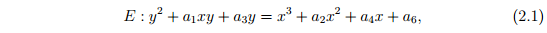
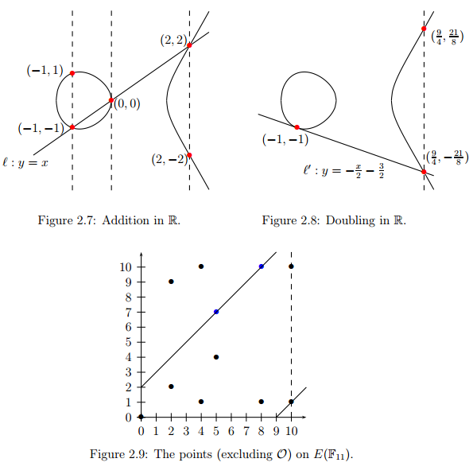
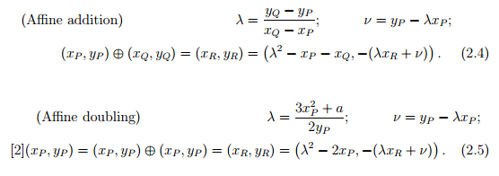
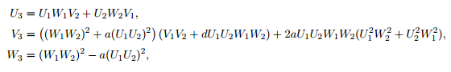

# a guide for Pairing

## basic concept

### `general Weierstrass equation`

### `short Weierstrass equation`

### `Group Law`

### `affine space`

equation: `E: y^2 = x^3 + a*x + b`

(x, y)

- add and double

### `projective space`

equation: `Ep: Y^2*Z = X^3 + a*X*Z^2 + b*Z^3`

(X, Y, Z) = (kx, ky, k)

conversion:

(x, y) -> (X, Y, Z)

    (x, y) -> (x, y, 1)

(X, Y, Z) -> (x, y)

    (X, Y, Z) -> (X/Z, Y/Z)

- add: P + Q = R

- Jacobian coordinates

x = X/Z^2

y = Y/Z^3

Y^2 = X^3 + 4*X*Z^4 − Z^6

### `Jacob-quartic curve`

- equation:

J : v^2 = a*u^4 + d*u^2 + 1

- conversion:

E -> J:
(x, y) -> (U, V, W)

J -> E:
(U, V, W) -> (x, y)

- add: P1 + P2 = P3

### other curves

`Edwards curves`

`Hessian curves`

`Montgoemry curves`

### Elliptic Curve computation

E(Fp): y^2 = x^3 + ax +b

`M` Multiplication

`S` Squaring

`I` Inversion

| COST              | R = [2]Q      | R = P + Q     | 
| ---               | ---           | ---           |
| Affine            | 2M + 2S + I   | 2M + S + I    |
| Projective        | 5M + 6S       | 12M + 2S      |
| Jacobi-Quartics   | 2M + 5S       | 6M + 4S       |

most optimised implementations of Fq arithmetic have I ≫ 20M, and the multiplication to
inversion ratio is commonly reported to be 80 : 1 or higher.

### Some characteristics

`Example 2.2.1`. Consider E/F101 : y^2 = x^3 + x + 1. The group
order is `#E(Fq)` = 105 = 3·5·7, and P = (47, 12) ∈ E is a `generator`. `Lagrange’s theorem` says that points (and subgroups) over the base field will have order
in {1, 3, 5, 7, 15, 21, 35, 105}. Indeed, to get a point of order r | 105, we simply
multiply P by the appropriate cofactor, which is h = #E/r. For example, a point
of order 3 is [35](47, 12) = (28, 8), a point of order 21 is [5](47, 12) = (55, 65),
and a point of order 1 is [105](47, 12) = O (which is the only such point).