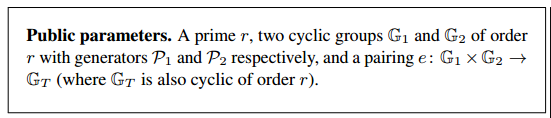
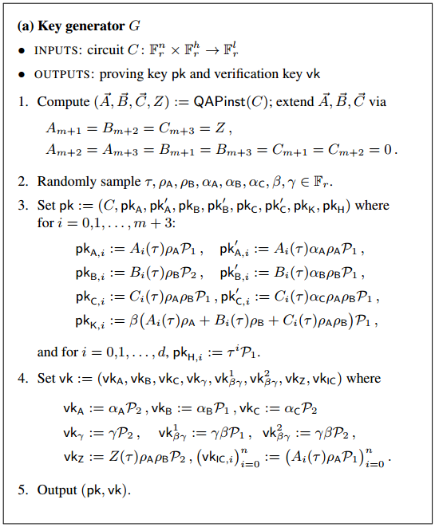
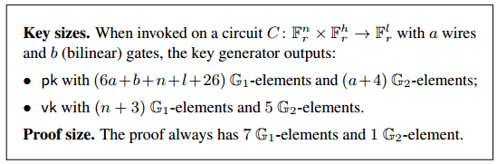
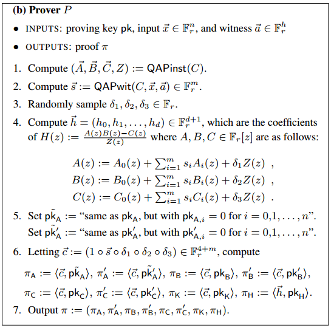
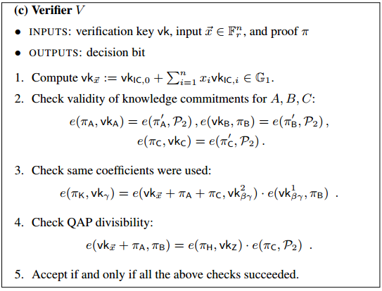

# a short introduction for `R1CS`

## 1. Simple Process

a picture from **Vitarlik**

* **Computation**

      function add(x,y){
        z = x + y
        return z
      }

      function poly(x){
        z = 3 + 2*x + 5*x^2
        return z
      }

* **Algebraic Circuit**

      ## `add` doesn't need to change.
      ## solution:: [1, x, y, z]
      function add(x,y){
        z = x + y
        return z
      }

      ## `poly` needs to be exploded
      ## solution:: [1, x, t, t1, t2, z]
      function poly(x){
        t  = x * x
        t1 = 2 * x
        t2 = 5 * t
        z  = 3 + t1 + t2
        return z
      }
      ## if x is 2, solution is [1, 2, 4, 4, 20, 27],
      ## which means z = 3 + 2*x + 5*x^2 is equal if x = 2 and z = 27.

  keywords: `wire` `gate` `constant wire` `...`

  **wire**:

  for function __poly()__, __[1, x, t, t1, t2, z]__ are all wires. __'1'__ is a constant wire, __'x'__ is an input wire, __'t, t1, t2'__ are internal wire and __'z'__ is output wire.

  **gate**

  for function __poly()__, there are `add` and `mul` gates, each gate can have __many inputs__ but only __1 output__. (for now we only have basic gates.)

* **R1CS**

  * What is R1CS

    Range 1 Constraint System.

    `<a, b, c>`

    `<s · a> * <s · b> = <s · c>`

    a, b, c are vectors and `<a, b, c>` is one constraint, a constraint system includes many different constraints.

    `<a1, b1, c1>` `<a2, b2, c2>` `<a3, b3, c3>` `...`

  * for example:

    `poly(x) =  z = 3 + 2*x + 5*x^2`

    `solution s = [1, x, t, t1, t2, z]`

    `gate t = x * x` >>> `<a1, b1, c1>`

        a = [0, 1, 0, 0, 0, 0]
        b = [0, 1, 0, 0, 0, 0]
        c = [0, 0, 1, 0, 0, 0]

    `gate t1 = x2 * x` >>> `<a2, b2, c2>`

        a = [2, 0, 0, 0, 0, 0]
        b = [0, 1, 0, 0, 0, 0]
        c = [0, 0, 0, 1, 0, 0]

    `gate t2 = 5 * t` >>> `<a3, b3, c3>`

        a = [5, 0, 0, 0, 0, 0]
        b = [0, 0, 1, 0, 0, 0]
        c = [0, 0, 0, 0, 1, 0]

    `gate z = 3 + t1 + t2 = (3 + t1 + t2) * 1 ` >>> `<a4, b4, c4>`

        a = [3, 0, 0, 1, 1, 0]
        b = [1, 0, 0, 0, 0, 0]
        c = [0, 0, 0, 0, 0, 1]

    `R1CS result` >>> put all <a_i,b_i,c_i> together.(i = 1,2,3,4)

        A =
        [0, 1, 0, 0, 0, 0]
        [2, 0, 0, 0, 0, 0]
        [5, 0, 0, 0, 0, 0]
        [3, 0, 0, 1, 1, 0]
        B =
        [0, 1, 0, 0, 0, 0]
        [0, 1, 0, 0, 0, 0]
        [0, 0, 1, 0, 0, 0]
        [1, 0, 0, 0, 0, 0]
        C =
        [0, 0, 1, 0, 0, 0]
        [0, 0, 0, 1, 0, 0]
        [0, 0, 0, 0, 1, 0]
        [0, 0, 0, 0, 0, 1]

* **QAP**
    * What is QAP

      Quadratic Arithmetic Programs

    * Example

        For matrix __A B C__ , construct __Aq Bq Cq__. Use [Lagrange's interpolation](https://en.wikipedia.org/wiki/Lagrange_polynomial).

        

        for matrix __A__, choose first column __[0, 2, 5, 3]__:
            A =
            1: [0, 1, 0, 0, 0, 0]
            2: [2, 0, 0, 0, 0, 0]
            3: [5, 0, 0, 0, 0, 0]
            4: [3, 0, 0, 1, 1, 0]

        We need to construct a polynomial __f(x)__ which satisfies:
            f(1) = 0, f(2) = 2, f(3) = 5, f(4) = 3
            also
            it cross points (1,0) (2,3) (3,5) (4,3)

        This is a little hard. We use __decomposition__: Let __f(x) = f1(x) + f2(x) + f3(x) + f4(x)__, where:
            f1(1) = 0, f1(2) = 0, f1(3) = 0, f1(4) = 0
            f2(1) = 0, f2(2) = 2, f2(3) = 0, f2(4) = 0
            f3(1) = 0, f3(2) = 0, f3(3) = 5, f3(4) = 0
            f4(1) = 0, f4(2) = 0, f4(3) = 0, f4(4) = 3
            except the diagonal, all equal to __ZERO__

        Now __f1234(x)__ can be constructed easily with
            f1(x) = (x-2)(x-3)(x-4)/(1-2)(1-3)(1-4) * 0 = 0
            f2(x) = (x-1)(x-3)(x-4)/(2-1)(2-3)(2-4) * 2 = -12 + 19 * x + -8 * x^2 +  1 * x^3
            f3(x) = (x-1)(x-2)(x-4)/(3-1)(3-2)(3-4) * 5 = 20 + -35 * x + 35/2 * x^2 + -5/2 * x^3
            f4(x) = (x-1)(x-2)(x-3)/(4-1)(4-2)(4-3) * 3 = -3 + 11/2 * x + -3 * x^2 + 1/2 * x^3   

        Then add them together, we get __f(x)__
            f(x) = 5 + -21/2 * x + 13/2 * x^2 + -1 * x^3

        Then we get first row of __Aq__, extracting coefficients in ascending order:
            [5, -21/2, 13/2, -1]

        Use same operating process for column 2,3,4,5,6 of Matrix __A__, getting row 2,3,4,5,6 of __Aq__.

            Aq =
            Aq1: [5, -21/2, 13/2, -1]
            Aq2: [...]
            Aq3: [...]
            Aq4: [...]
            Aq5: [...]
            Aq6: [...]

        And __Bq Cq__ . So __A__ is 4x6 and then __Aq__ is 6x4.

        Like
            A·s * B·s = C·s
        We use
            Aq·s * Bq·s - Cq·s
            = [xx, xx, xx, xx] * [xx, xx, xx, xx] - [xx, xx, xx, xx]
            = [xxx, xxx, xxx, xxx, xxx, xxx, xxx] -> R
            "O(3) * O(3) - O(3) = O(6)"
        For x = 1, 2, 3, 4
            R(x) = 0

        Now we use Zq(x) = (x-1)(x-2)(x-3)(x-4) and construct an equation:

            R(x) = H * Zq(x)

            Zq(x) = (x-1)(x-2)(x-3)(x-4) = 24 + -50 * x + 35 * x^2 + -10 * x^3 + 1 * x^4

            Zq = [24, -50, 35, -10, 1]

            this is for purpose that when x = 1, 2, 3, 4, equation R(x) = H * Zq(x) holds.

            calculate H = R / Zq, division has no remainder, so it's easy to compute.

        Soooooo, QAP is finished, including
            Aq : 6x4 Matrix
            Bq : 6x4 Matrix
            Cq : 6x4 Matrix
            Zq : 1x4 Vector
            H :  1x3 Vector
        We call it __QAP instance__.

        Notice that every number above will be substituted with __finite field elements__, which is used in Crypto.

        __Usage::__ if someone give you a solution `s`, check:
            Aq·s * Bq·s - Cq·s ?= H * Zq

## 2. Zero Knowledge
  But, how could we verify `Aq·s * Bq·s - Cq·s ?= H * Zq` without knowing `s` ?

  We have master's support !

  The paper [PGHR13](https://www.microsoft.com/en-us/research/wp-content/uploads/2016/02/pinocchio.pdf) has a complete scheme. Following pictures are simple reviews.

  

  

  

  

  

  With Ellpitic Curve and amazing Pairing Theory, everything can be done easily.

  So we jump this part...

## 3. An Example of Sudoku
capture from [https://blockchain.iethpay.com/zero-knowledge-zkSNARKs.html](https://blockchain.iethpay.com/zero-knowledge-zkSNARKs.html)

## 4. Current Tools

#### SNARK

1. [__scipr-lab__ - libsnark](https://github.com/scipr-lab/libsnark)

2. [__akosba__ - jsnark](https://github.com/akosba/jsnark)

3. [__akosba__ - xjsnark](https://github.com/akosba/xjsnark)

    "a high-level framework for developing applications for zk-SNARKs. xJsnark aims at bridging the gap between high-level programming and performance. xJsnark's front end is currently developed as a java extension on top of Jetbrains MPS V 3.3.5. __At this point, xJsnark produces circuits using the same format as jsnark, which are transformed to r1cs constraints using the jsnark-libsnark interface.__"

    [paper link](http://www.cs.umd.edu/~akosba/papers/xjsnark.pdf)

    __Good:__

      > if .. else ..

      > for ..

      > children function, use codes repeatly

      > almost every commonly used grammar
      >> `+ - * /`
      >>
      >> `>> << | & ^ ~`

      > wire operation
      >> `EQ NEQ` - check if wires are equal
      >>
      >> `NOT AND OR`

      > many predefined number types
      >> `uint_size` size can be a number for the type's bit length

      > do a great optimization for circuit, it reduce sha256's gate quantity from 34844 to 26052 with arithmetic minimization

    __Bad:__

      > DSL - Domain Specific Language
      >> need to use `MPS` IDE
      >>
      >> need time to learn its new grammar

      > this tool only generate circuit file: `xxx.arith`. need to use jsnark interface to run libsnark with `xxx.arith` to generate QAP, pk, vk, proof ... It only generate a optimized R1CS.

      > functions still need to be wrote by programmer.

    `SHA256`

        Circuit file size:  1.4 MB
        Number of total mul gates before arithmetic minimization =  34844
        Number of total mul gates after  arithmetic minimization =  26052
        Total Savings due to arithmetic minimizations = 8792

4. [__o1-labs__ - snarky](https://github.com/o1-labs/snarky)

5. [__jancarlsson__ - snarklib](https://github.com/jancarlsson/snarklib)

6. [__jancarlsson__ - snarkfront](https://github.com/jancarlsson/snarkfront)

7. [__JacobEberhardt__ - ZoKrates](https://github.com/JacobEberhardt/ZoKrates)

#### STARK

8. [__elibensasson__ - libSTARK](https://github.com/elibensasson/libSTARK)

## Further Reading

* [__Gregory Maxwell:__ The first successful Zero-Knowledge Contingent  Payment](https://bitcoincore.org/en/2016/02/26/zero-knowledge-contingent-payments-announcement/)
* [__Github:__ Pay to Sudoku](https://github.com/zcash-hackworks/pay-to-sudoku)
